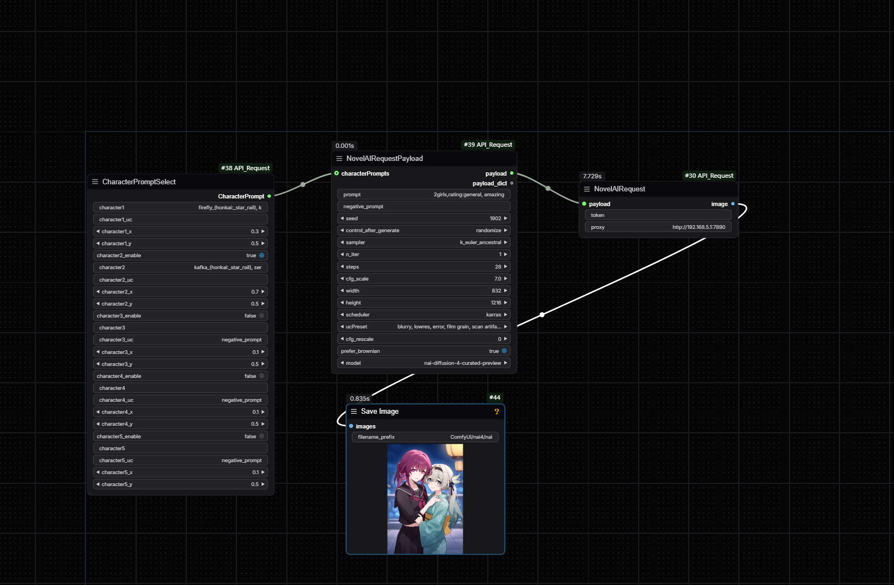

# Comfyui SD-API/NOVELAI API请求节点/request node

## support SD-WEBUI API and NOVELAI (support nai-diffusion-3 and nai-diffusion-4)/支持请求SD-WEBUI API以及 NOVELAI(支持nai-diffusion-3和nai-diffusion-4)


- https://github.com/AUTOMATIC1111/stable-diffusion-webui/wiki/API
- https://novelai.net/image



## SETUP
- 在comfyui根目录下创建.env文件, 编写 NOVELAI_TOKEN 以调用NOVELAI
- create .env file in the root directory of comfyui, write NOVELAI_TOKEN to call NOVELAI

```dotenv
NOVELAI_TOKEN=ey....
```

## Get Token
- 打开控制台, 输入以下命令
- Open console, type

```js
console.log(JSON.parse(localStorage.session).auth_token);
```


